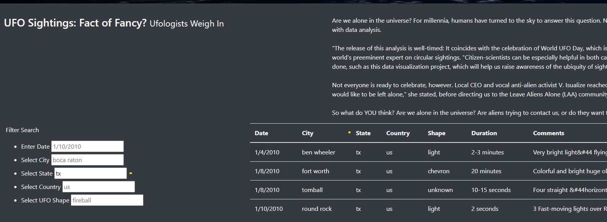

# UFO Reporting

## Overview
The purpose of this assignment was twofold. The first was to continue practicing HTML and CSS.  Secondly, learn and incorporate JS and apps to retrieve display and filter data in a way to make a simple interactive web-page.   

## Results | Using the Page
The page is very simple with filter inputs on the left that are able to dynamically filter a data table for users.  Vistiors may use this website to discover summary UFO reports across many regions.  

## Summary
While the design meets requirments, one major drawback is the abcense navigable drop-downs to show what value are include in each filter key. Adding these will allow for a more fluid user experience
